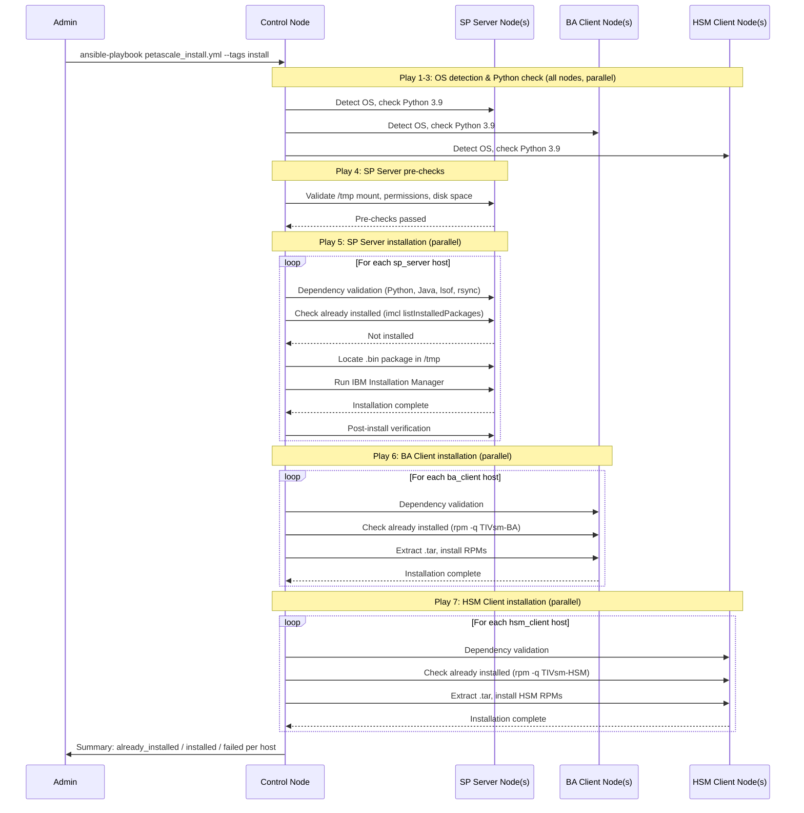
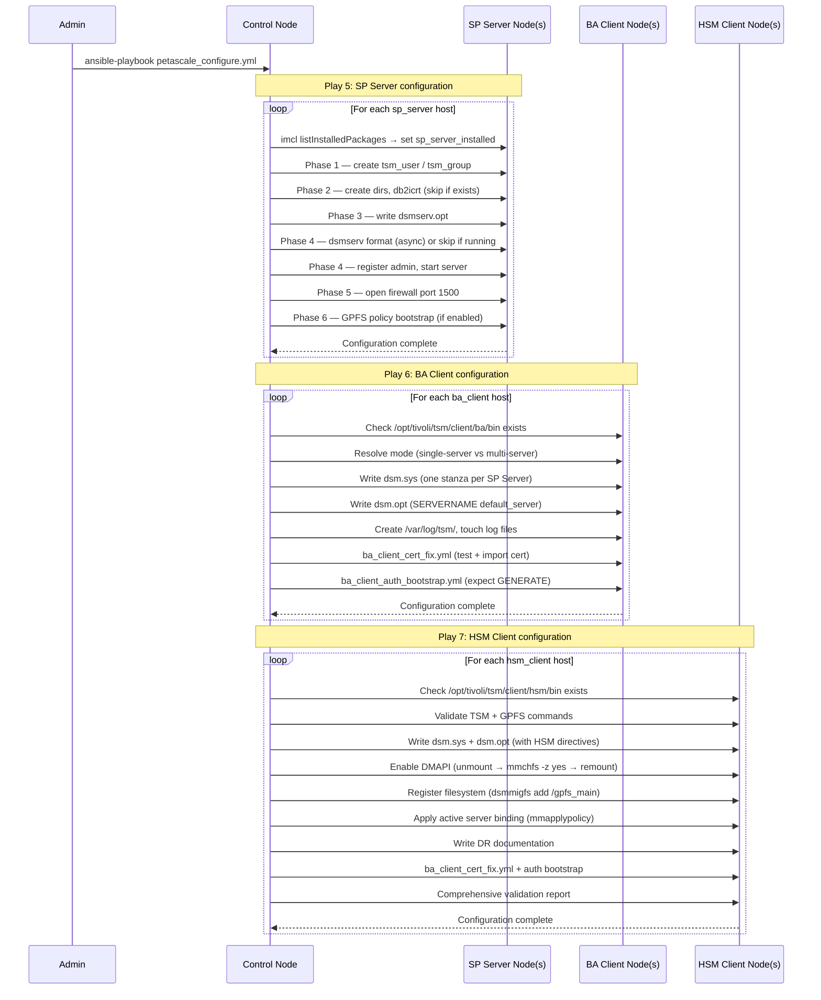

# IBM Storage Protect — Petascale Deployment & Configuration Design Document

## Document Information

- **Document Title**: Petascale Deployment & Configuration Ansible Automation Design
- **Version**: 1.0
- **Date**: 2026-01-01
- **Status**: Active
- **Author**: IBM Storage Protect Ansible Team

---

## Table of Contents

1. [Introduction](#1-introduction)
2. [Document Scope](#2-document-scope)
3. [Architecture Overview](#3-architecture-overview)
4. [Component Details](#4-component-details)
5. [Lifecycle Management](#5-lifecycle-management)
6. [Configuration Management](#6-configuration-management)
7. [Multi-Server Topology Design](#7-multi-server-topology-design)
8. [Security Design](#8-security-design)
9. [Error Handling & Idempotency](#9-error-handling--idempotency)
10. [Performance & Scalability](#10-performance--scalability)
11. [Usage Examples](#11-usage-examples)
12. [Troubleshooting Design](#12-troubleshooting-design)
13. [References](#13-references)

---

## 1. Introduction

### Purpose

This document describes the design of the IBM Storage Protect Petascale Deployment & Configuration Ansible Automation. It covers the architecture, components, workflows, and design decisions for the three core playbooks:

- `petascale_install.yml` — installs SP Server, HSM Client, and BA Client software
- `petascale_configure.yml` — performs post-install configuration of all components
- `petascale_uninstall.yml` — removes components with data preservation

The design supersedes earlier drafts and reflects the implementation in the `ansible-storage-protect` repository on the `petascale-clean` branch.

### What is the Petascale Automation?

The Petascale automation is an Ansible-based solution for deploying IBM Storage Protect in high-scale GPFS environments. It automates the full lifecycle — from OS-level dependency validation through SP Server database initialisation, GPFS policy bootstrap, HSM client filesystem registration, and SSL certificate management — across multiple target nodes simultaneously.

### Design Goals

| Goal | Description |
|---|---|
| **Idempotency** | Every task is safe to re-run; already-complete steps are skipped, not re-executed |
| **Node separation** | SP Server and BA/HSM Client roles are enforced to run on separate inventory groups |
| **Dependency validation** | Pre-flight checks catch missing prerequisites before any installation begins |
| **Graceful failure** | Partial failures roll back changes on the affected node without disrupting other nodes |
| **Multi-server scale** | Clients support distributing GPFS filesets across multiple SP Servers in a single run |
| **Separation of concerns** | Install, configure, and uninstall are distinct playbooks with no overlap |

### Business Value

- **Reduced deployment time** — Hours instead of days for full SP + GPFS HSM deployments
- **Consistency** — Eliminates configuration drift and human errors across many nodes
- **Scalability** — Supports simultaneous deployment to tens of SP Servers and hundreds of BA/HSM clients
- **Operational efficiency** — Post-install configuration (DB2 instance, GPFS policy, SSL) fully automated
- **Risk mitigation** — Validated, tested deployment procedures with rollback on failure

---

## 2. Document Scope

### 2.1 Covered Lifecycle Operations

| Operation | Playbook | Description |
|---|---|---|
| **Install** | `petascale_install.yml` | Fresh installation of SP Server, HSM Client, BA Client |
| **Configure** | `petascale_configure.yml` | Post-install DB2/server/client configuration and GPFS setup |
| **Uninstall** | `petascale_uninstall.yml` | Complete component removal with data preservation |
| **Upgrade** | `petascale_upgrade.yml` | *(Future work — not yet production-ready)* |

### 2.2 Supported Platforms

#### Operating Systems

| Component | OS | Architecture |
|---|---|---|
| SP Server | RHEL 7/8/9, SLES 12/15, Ubuntu 18.04/20.04/22.04 | x86_64 |
| BA Client | Linux (above), AIX | x86_64, ppc64, ppc64le, s390x |
| HSM Client | Linux (above), AIX | x86_64, ppc64le (GPFS only) |

#### IBM Storage Protect Versions

- SP Server 8.1.25+ through 8.2.x
- BA Client 8.1.25+ through 8.2.x
- HSM Client 8.1.25+ through 8.2.x

### 2.3 Out of Scope

- Operations Center (OC) installation and configuration
- Storage Agent (LAN-Free) configuration
- Application protection (DB2, SAP, Oracle)
- Cloud storage tier configuration
- Container / Kubernetes deployments
- Windows platform deployments
- SP Server upgrade automation (planned future work)

---

## 3. Architecture Overview

### 3.1 High-Level Architecture

```
┌──────────────────────────────────────────────────────────────┐
│                    Ansible Control Node                       │
│                                                              │
│  Administrator / CI-CD                                       │
│        │                                                     │
│        ▼                                                     │
│  ansible-playbook CLI ──► Inventory (petascale.ini)          │
│                      ──► host_vars / group_vars              │
│                      ──► Ansible Vault (credentials)         │
│                                                              │
│  ┌─────────────────────────────────────────────────────┐     │
│  │              Playbook Layer                          │     │
│  │  petascale_install.yml                               │     │
│  │  petascale_configure.yml                             │     │
│  │  petascale_uninstall.yml                             │     │
│  └────────────────────┬────────────────────────────────┘     │
│                       │                                      │
│  ┌────────────────────▼────────────────────────────────┐     │
│  │               Role Layer                             │     │
│  │  roles/sp_server_install/  roles/ba_client_install/  │     │
│  │  roles/hsm_client_install/                           │     │
│  └────────────────────┬────────────────────────────────┘     │
└───────────────────────┼──────────────────────────────────────┘
                        │ SSH
        ┌───────────────┼─────────────────────────────┐
        │               │                             │
        ▼               ▼                             ▼
┌──────────────┐ ┌──────────────┐             ┌──────────────┐
│  SP Server   │ │  BA Client   │             │  HSM Client  │
│  Node(s)     │ │  Node(s)     │     ...     │  Node(s)     │
│              │ │              │             │              │
│ dsmserv      │ │ dsmc         │             │ dsmmigfs     │
│ DB2 instance │ │ dsm.sys      │             │ dsm.sys      │
│ GPFS stgpool │ │ dsm.opt      │             │ dsm.opt      │
│ port 1500    │ │ SSL cert     │             │ DMAPI        │
└──────────────┘ └──────┬───────┘             └──────┬───────┘
                        │ TCP 1500                   │ TCP 1500
                        └─────────────┬──────────────┘
                                      ▼
                              SP Server port 1500
```

### 3.2 Layered Architecture

```
Layer 1 — User Interface
    ansible-playbook CLI  │  CI/CD pipeline  │  Ansible Tower/AWX

Layer 2 — Playbooks (Orchestration)
    petascale_install.yml  │  petascale_configure.yml  │  petascale_uninstall.yml

Layer 3 — Ansible Roles (Execution)
    sp_server_install/   │   ba_client_install/   │   hsm_client_install/

Layer 4 — Task Files (Implementation)
    sp_server_install_linux.yml         ba_client_install_linux.yml
    sp_server_prechecks_linux.yml       ba_client_uninstall_linux.yml
    sp_server_configure_petascale.yml   ba_client_cert_fix.yml
    sp_server_stop_services.yml         ba_client_auth_bootstrap.yml
    sp_server_uninstall_linux.yml

Layer 5 — Target Hosts
    [sp_servers]   │   [ba_clients]   │   [hsm_clients]
```

### 3.3 Inventory Group Model

```
petascale_infrastructure
├── sp_servers          ← SP Server nodes (separate from clients, mandatory)
├── ba_clients          ← BA Client nodes
└── hsm_clients         ← HSM Client nodes (GPFS required)
```

Key constraint: **a host may appear in only one group**. SP Server and clients on the same node are explicitly unsupported due to incompatible GSKit versions (SP Server requires GSKit 8.0.55.x; clients require GSKit 8.0.60.x).

### 3.4 Component Interaction Matrix

| Initiator | Target | Mechanism | Purpose |
|---|---|---|---|
| `petascale_install.yml` | `sp_server_install` role | `import_role` / `include_role` | SP Server installation |
| `petascale_install.yml` | `ba_client_install` role | `import_role` / `include_role` | BA Client installation |
| `petascale_install.yml` | `hsm_client_install` role | `import_role` / `include_role` | HSM Client installation |
| `petascale_configure.yml` | `sp_server_configure_petascale.yml` | task file include | SP Server post-install config |
| `petascale_configure.yml` | `ba_client_cert_fix.yml` | task file include | SSL certificate import |
| `petascale_configure.yml` | `ba_client_auth_bootstrap.yml` | task file include | Auth cache bootstrap |
| `petascale_configure.yml` | SP Server (delegate_to) | `dsmadmc` CLI over SSH | GPFS policy, node registration |
| `petascale_uninstall.yml` | `sp_server_uninstall_linux.yml` | task file include | SP Server removal |
| `petascale_uninstall.yml` | `ba_client_install` role | `import_role` / `include_role` | BA/HSM Client removal |
| BA/HSM Client | SP Server | TCP 1500 | Backup, migration, recall |
| SP Server config | SP Server (localhost) | `dsmadmc` stdin pipe | DB format, admin registration |

---

## 4. Component Details

### 4.1 Playbooks

#### `petascale_install.yml`

**Purpose**: Orchestrates fresh installation of all three component types across their respective inventory groups.

**Plays (in order)**:

| Play # | Hosts | Description |
|---|---|---|
| 1 | `all` | OS detection — sets `ansible_python_interpreter` for Linux or AIX |
| 2 | `localhost` | Banner — prints targeted groups and records start time |
| 3 | `all` | Python 3.9 pre-check — warns if absent, does not abort |
| 4 | `sp_servers` | Pre-checks — validates `/tmp` mount options, permissions, disk space |
| 5 | `sp_servers` | Installation — dependency validation, package discovery, SP Server install |
| 6 | `ba_clients` | Installation — dependency validation, BA Client install |
| 7 | `hsm_clients` | Installation — dependency validation, HSM Client install |
| 8 | `localhost` | Summary report — elapsed time, per-node results |

**Idempotency**: The install role checks whether the component is already installed via IBM Installation Manager (`imcl listInstalledPackages`) or RPM queries before proceeding. Already-installed nodes are added to an `already_installed` results list and skipped.

**Safety gate for SP Server**: SP Server installation tasks are tagged `install`. The tag must be explicitly passed (`--tags install`) to permit SP Server installation. This prevents accidental re-installation in environments where clients are re-deployed independently.

#### `petascale_configure.yml`

**Purpose**: Post-install configuration of all components. Does not install, upgrade, or remove software.

**Plays (in order)**:

| Play # | Hosts | Description |
|---|---|---|
| 1 | `all` | OS detection |
| 2 | `localhost` | Banner |
| 3 | `all` | Python 3.9 check |
| 4 | `sp_servers` | Pre-check — detects `sp_server_installed` fact via `imcl` |
| 5 | `sp_servers` | Configure — skipped if `configure_servers=false` or not installed |
| 6 | `ba_clients` | Configure — skipped if `configure_clients=false` |
| 7 | `hsm_clients` | Configure — skipped if `configure_clients=false` |
| 8 | `localhost` | Summary |

**Runtime control variables**:

| Variable | Default | Effect |
|---|---|---|
| `configure_servers` | `true` | Set `false` to skip all SP Server plays |
| `configure_clients` | `true` | Set `false` to skip all BA/HSM Client plays |

#### `petascale_uninstall.yml`

**Purpose**: Removes components. A dry run (no `confirm_uninstall`) prints what would be removed. Actual removal requires `-e "confirm_uninstall=yes"`.

**Plays (in order)**:

| Play # | Hosts | Description |
|---|---|---|
| 1 | `all` | OS detection |
| 2 | `sp_servers` | Stop services (`dsmserv halt`, DB2 deactivate) |
| 3 | `sp_servers` | Uninstall SP Server via IBM Installation Manager |
| 4 | `ba_clients` | Stop `dsmcad.service`, terminate processes, uninstall RPMs |
| 5 | `hsm_clients` | Stop HSM processes, uninstall RPMs |
| 6 | `localhost` | Summary |

**Data preservation**: Configuration files are backed up to `.bk` files. RPM packages are backed up to `/opt/*ClientPackagesBk`. SP Server database files, backup history, and node registrations are not touched.

---

### 4.2 Ansible Roles

#### `roles/sp_server_install`

**Responsibilities**: SP Server installation and uninstallation on Linux.

**Key task files**:

| File | Purpose |
|---|---|
| `tasks/main.yml` | Entry dispatcher — routes to install, configure, uninstall by state |
| `tasks/sp_server_prechecks_linux.yml` | Validates Python, Java, lsof, rsync, `/tmp` mount, disk space |
| `tasks/sp_server_install_linux.yml` | Discovers `.bin` package, runs IBM Installation Manager |
| `tasks/sp_server_clean_config.yml` | Removes configuration artifacts on uninstall |
| `tasks/sp_server_uninstall_linux.yml` | Stops processes, invokes IBM IM uninstall |
| `tasks/sp_server_stop_services.yml` | Stops `dsmserv`, deactivates DB2 |
| `tasks/sp_server_configuration_petascale.yml` | Post-install configuration (Phases 1–6, see §5.2) |

#### `roles/ba_client_install`

**Responsibilities**: BA Client and HSM Client installation, uninstallation, and configuration on Linux and AIX.

**Key task files**:

| File | Purpose |
|---|---|
| `tasks/main.yml` | Entry dispatcher |
| `tasks/ba_client_install_linux.yml` | Extracts `.tar`, runs RPM install |
| `tasks/ba_client_uninstall_linux.yml` | Stops daemon, removes RPMs, backs up config |
| `tasks/ba_client_cert_fix.yml` | Tests connection, imports SSL cert per SP Server |
| `tasks/ba_client_auth_bootstrap.yml` | PASSWORDACCESS GENERATE bootstrap via `expect` |

#### `roles/hsm_client_install`

**Responsibilities**: HSM Client installation and configuration. Extends the BA Client role with GPFS-specific steps.

**Additional task files**:

| File | Purpose |
|---|---|
| `tasks/hsm_client_install_linux.yml` | Extracts HSM `.tar`, installs HSM RPMs |
| `tasks/hsm_client_configure.yml` | DMAPI enablement, filesystem registration, active server binding, DR docs, validation report |

**Templates**:

| File | Purpose |
|---|---|
| `templates/hsm_active_binding_policy.j2` | Generates GPFS policy file for `mmapplypolicy` to set `dmapi.IBMServ` attribute |

---

### 4.3 Key Task File: `sp_server_configuration_petascale.yml`

This is the most complex task file in the automation. It runs on `sp_servers` nodes and executes in six sequential phases:

| Phase | Steps |
|---|---|
| **1 — TSM user & group** | Create OS group `tsm_group` (GID `tsm_group_gid`), create OS user `tsm_user` (UID `tsm_user_uid`), set password, fix home directory ownership |
| **2 — Directories & DB2 instance** | Create base/db/alog/archlog directories, fix `/opt/tivoli/tsm/db2` ownership, run `db2icrt -a server -u tsminst1 tsminst1` (skip if instance exists), configure `LD_LIBRARY_PATH` in `sqllib/userprofile` |
| **3 — `dsmserv.opt`** | Copy `dsmserv.opt.smp` to base directory (first run only), update/add `commmethod`, `tcpport`, `ACTIVELOGSIZE`, `COMMTIMEOUT`, `DEDUPREQUIRESBACKUP`, `EXPINTERVAL`, validate disk space |
| **4 — Database format & admin** | If dsmserv running: skip format, check admin exists. If not running: async `dsmserv format` (timeout configurable, default 1800 s), pipe `register admin`, `grant authority`, `halt`. Start server in background, poll TCP port until available |
| **5 — Firewall** | Open `tcpport` (default 1500) in `firewalld` (runtime + permanent). Skipped if firewalld inactive |
| **6 — GPFS policy bootstrap** | If `gpfs_policy_bootstrap_enabled: true`: `define stgpool`, `define stgpooldirectory`, `define domain`, `define policyset`, `define mgmtclass`, `define copygroup`, `assign defmgmtclass`, `validate policyset`, `activate policyset`. Register HSM client nodes via `register node`. Each step queries before acting — idempotent |

---

### 4.4 Key Task File: `ba_client_cert_fix.yml`

Handles SSL trust establishment between clients and SP Servers. Design:

```
Test connection with dsmadmc
    │
    ├── No error ──► Skip (cert already trusted)
    │
    └── ANS1695E / ANS1592E / ANS1593E detected
            │
            ├── Multi-server mode:
            │     For each sp_server in sp_servers list:
            │       delegate_to: {{ sp_server.inventory_name }}
            │         fetch /home/tsminst1/cert256.arm → controller temp
            │       copy to client → dsmcert -add -label SP01 -file cert256.arm
            │
            └── Single-server mode:
                  openssl s_client → extract cert PEM
                  dsmcert -add -label SP01 -file cert.pem
```

**Key design decisions**:
- Uses `delegate_to` on the SP Server play to fetch the certificate without requiring a separate connection credential
- Detects error codes rather than always running to avoid certificate store pollution
- Per-server certificate import in multi-server mode ensures all server trusts are established

---

## 5. Lifecycle Management

### 5.1 Installation Workflow



### 5.2 Configuration Workflow



### 5.3 Uninstallation Workflow

```
Admin runs:
  ansible-playbook petascale_uninstall.yml -e "confirm_uninstall=yes"

  │
  ├── Play 2: SP Server — stop services
  │     dsmserv halt (via dsmadmc pipe)
  │     db2 deactivate database
  │     kill remaining dsmserv processes
  │
  ├── Play 3: SP Server — uninstall
  │     imcl uninstall com.tivoli.dsm.server
  │     Remove installation directories
  │     Backup dsmserv.opt → dsmserv.opt.bk
  │
  ├── Play 4: BA Client — uninstall
  │     systemctl stop dsmcad.service
  │     pkill dsmc / dsmcad
  │     rpm -e TIVsm-BA TIVsm-API
  │     Backup /opt/tivoli/tsm/client/ba/bin/*.opt → *.opt.bk
  │     Backup RPMs → /opt/baClientPackagesBk/
  │
  └── Play 5: HSM Client — uninstall
        Stop dsmmigratemon, dsmwatchdog
        rpm -e TIVsm-HSM
        Backup HSM config → *.bk files
```

### 5.4 State Machine

```
                    ┌──────────────────┐
                    │   NOT INSTALLED  │
                    └────────┬─────────┘
                             │ petascale_install.yml
                             │ (--tags install for SP Server)
                             ▼
                    ┌──────────────────┐
                    │    INSTALLED     │◄─────────────────┐
                    └────────┬─────────┘                  │
                             │ petascale_configure.yml     │ (re-run is safe
                             ▼                             │  — idempotent)
                    ┌──────────────────┐                  │
                    │   CONFIGURED     │──────────────────►┘
                    └────────┬─────────┘
                             │ petascale_uninstall.yml
                             │ -e "confirm_uninstall=yes"
                             ▼
                    ┌──────────────────┐
                    │   NOT INSTALLED  │
                    │ (data preserved) │
                    └──────────────────┘
```

---

## 6. Configuration Management

### 6.1 Variable Hierarchy

```
┌─────────────────────────────────────────────────────────────┐
│  Priority 1 (highest): CLI -e flags                         │
│    ansible-playbook ... -e "server_size=xsmall"             │
├─────────────────────────────────────────────────────────────┤
│  Priority 2: host_vars/<hostname>.yml                       │
│    playbooks/host_vars/sp-server-01.yml                     │
│    playbooks/host_vars/ba-client-01.yml                     │
│    playbooks/host_vars/hsm-client-03.yml                    │
├─────────────────────────────────────────────────────────────┤
│  Priority 3: group_vars/<groupname>.yml                     │
│    playbooks/group_vars/sp_servers.yml                      │
│    playbooks/group_vars/ba_clients.yml                      │
│    playbooks/group_vars/hsm_clients.yml                     │
├─────────────────────────────────────────────────────────────┤
│  Priority 4: group_vars/all.yml                             │
│    Global defaults (Python path, ansible_become, etc.)      │
├─────────────────────────────────────────────────────────────┤
│  Priority 5 (lowest): Role defaults                         │
│    roles/*/defaults/main.yml                                │
└─────────────────────────────────────────────────────────────┘
```

### 6.2 Variable Scoping Design

Each component's variables are namespaced to avoid collisions:

| Namespace | Used by | Examples |
|---|---|---|
| `sp_server_*` | SP Server role and configure tasks | `sp_server_version`, `sp_server_package_path`, `sp_server_active_log_size` |
| `ba_client_*` | BA Client role | `ba_client_version`, `ba_client_package_path`, `ba_client_state` |
| `hsm_client_*` | HSM Client role | `hsm_client_version`, `hsm_client_package_path`, `hsm_client_state` |
| `gpfs_*` | SP Server GPFS bootstrap | `gpfs_policy_bootstrap_enabled`, `gpfs_storage_pool_name`, `gpfs_policy_domain` |
| `hsm_*` | HSM Client configure | `hsm_node_password`, `hsm_policy_domain`, `hsm_storage_pool_name` |
| `server_*` | SP Server identity | `server_name`, `server_size`, `server_password` |
| `tsm_*` | SP Server OS user | `tsm_user`, `tsm_group`, `tsm_user_uid`, `tsm_group_gid` |

### 6.3 Connection Mode Selection

The configure playbook supports single-server and multi-server modes for BA and HSM clients, selected automatically:

```
if sp_servers is defined and sp_servers | length > 0:
    mode = MULTI_SERVER
    dsm.sys: one stanza per entry in sp_servers list
    dsm.opt: SERVERNAME {{ default_server }}
    HSM dsm.opt: also adds HSMMULTISERVER YES, HSMEXTOBJIDATTR YES, etc.
else:
    mode = SINGLE_SERVER
    dsm.sys: one stanza using sp_server_name / sp_server_address / sp_server_port
    dsm.opt: SERVERNAME {{ sp_server_name }}
```

### 6.4 SP Server Active Log Size Logic

```
if sp_server_active_log_size is explicitly set:
    use that value (MB)
else:
    derive from server_size:
        xsmall → 30,000 MB
        small  → 65,536 MB
        medium → 131,072 MB
        large  → 262,144 MB
```

### 6.5 File Layout

```
playbooks/
├── petascale_install.yml
├── petascale_configure.yml
├── petascale_uninstall.yml
├── petascale_upgrade.yml          ← future work
├── inventory/
│   └── petascale.ini
├── group_vars/
│   ├── all.yml
│   ├── sp_servers.yml
│   ├── ba_clients.yml
│   └── hsm_clients.yml
└── host_vars/
    ├── sp-server-01.yml
    ├── sp-server-02.yml
    ├── ba-client-01.yml
    ├── ba-client-02.yml
    └── hsm-client-03.yml

roles/
├── sp_server_install/
│   ├── tasks/
│   │   ├── main.yml
│   │   ├── sp_server_prechecks_linux.yml
│   │   ├── sp_server_install_linux.yml
│   │   ├── sp_server_configuration_petascale.yml   ← configure phases 1-6
│   │   ├── sp_server_stop_services.yml
│   │   ├── sp_server_clean_config.yml
│   │   └── sp_server_uninstall_linux.yml
│   └── defaults/main.yml
├── ba_client_install/
│   ├── tasks/
│   │   ├── main.yml
│   │   ├── ba_client_install_linux.yml
│   │   ├── ba_client_uninstall_linux.yml
│   │   ├── ba_client_cert_fix.yml
│   │   └── ba_client_auth_bootstrap.yml
│   └── defaults/main.yml
└── hsm_client_install/
    ├── tasks/
    │   ├── main.yml
    │   ├── hsm_client_install_linux.yml
    │   └── hsm_client_configure.yml
    ├── templates/
    │   └── hsm_active_binding_policy.j2
    └── defaults/main.yml
```

---

## 7. Multi-Server Topology Design

### 7.1 Overview

A single GPFS cluster can back up to multiple SP Servers simultaneously, with each SP Server responsible for a distinct GPFS fileset. The `sp_servers` list variable in a client's host_vars activates multi-server mode.

```
GPFS Cluster (/gpfs_main)
├── fileset_1 ──► SP Server 01 (PETASCALE-SP01, 9.11.53.28)
├── fileset_2 ──► SP Server 02 (PETASCALE-SP02, 9.11.53.29)
└── fileset_3 ──► SP Server 03 (PETASCALE-SP03, 9.11.53.30)
```

### 7.2 Active Server Binding

Each file in a GPFS fileset carries a `dmapi.IBMServ` DMAPI attribute that tells the HSM client which SP Server to use for migrate and recall operations.

```
File in /gpfs_main/fileset_1/
    DMAPI attr: dmapi.IBMServ = "PETASCALE-SP01"
    → HSM client routes all migrate/recall to SP Server 01

File in /gpfs_main/fileset_2/
    DMAPI attr: dmapi.IBMServ = "PETASCALE-SP02"
    → HSM client routes all migrate/recall to SP Server 02
```

**How the automation sets this attribute:**

```
Phase 6 — HSM configure (hsm_client_configure.yml):
    1. Render hsm_active_binding_policy.j2 → /tmp/hsm_active_binding_policy_<host>.txt
    2. mmapplypolicy /gpfs_main -P <policy_file> -I defer
    3. Fallback 1: mmputattr -k dmapi.IBMServ -v <SERVER_NAME> per fileset
    4. Fallback 2: setfattr -n user.dmapi.IBMServ per fileset
    5. Verify: mmlsattr -L <test_file> | grep IBMServ
```

### 7.3 `dsm.sys` Generation for Multi-Server Mode

```
Generated /opt/tivoli/tsm/client/hsm/bin/dsm.sys:

SERVERNAME PETASCALE-SP01
  COMMMethod         TCPip
  TCPPort            1500
  TCPServeraddress   9.11.53.28
  NODename           hsm-client-03-sp01
  PASSWORDACCESS     GENERATE
  ERRORLOGNAME       /var/log/tsm/dsmerror_petascale-sp01.log
  SCHEDLOGNAME       /var/log/tsm/dsmsched_petascale-sp01.log
  DOMAIN             /gpfs_main/fileset_2

SERVERNAME PETASCALE-SP02
  COMMMethod         TCPip
  TCPPort            1500
  TCPServeraddress   9.11.53.29
  NODename           hsm-client-03-sp02
  PASSWORDACCESS     GENERATE
  ERRORLOGNAME       /var/log/tsm/dsmerror_petascale-sp02.log
  SCHEDLOGNAME       /var/log/tsm/dsmsched_petascale-sp02.log
  DOMAIN             /gpfs_main/fileset_3
```

### 7.4 GPFS Policy Bootstrap on SP Server

When `gpfs_policy_bootstrap_enabled: true` on an SP Server, the configure playbook establishes the minimum working TSM policy for GPFS workloads:

```
dsmadmc commands executed via stdin pipe:
  define stgpool GPFSPOOL FILE maxscratch=0
  define stgpooldirectory GPFSPOOL /tmp/data maxsize=100G
  define domain GPFS_DOMAIN
  define policyset GPFS_DOMAIN STANDARD
  define mgmtclass GPFS_DOMAIN STANDARD GPFS_DAILY
  define copygroup GPFS_DOMAIN STANDARD GPFS_DAILY type=backup
      verexists=30 verdeleted=60 retextra=30 retonly=90
  assign defmgmtclass GPFS_DOMAIN STANDARD GPFS_DAILY
  validate policyset GPFS_DOMAIN STANDARD
  activate policyset GPFS_DOMAIN STANDARD
  register node hsm-client-03-sp01 <password> domain=GPFS_DOMAIN
  register node hsm-client-03-sp02 <password> domain=GPFS_DOMAIN
  ...
```

Each command is preceded by a `query` to check for prior existence — `define` is only run if the object does not already exist.

### 7.5 Node Registration Cross-Reference

The SP Server `gpfs_policy_bootstrap` registers HSM client nodes by reading the `sp_servers` list from each HSM client's host_vars. This is implemented via a `delegate_to` pattern: the task runs in the context of the SP Server but reads variables from the HSM client host.

```yaml
# Conceptual representation
- name: Register HSM nodes on SP Server
  delegate_to: "{{ sp_server_inventory_hostname }}"
  command: >
    dsmadmc -id={{ admin_name }} -password={{ admin_password }}
    "register node {{ item.node_name }} {{ hsm_node_password }}
     domain={{ gpfs_policy_domain }}"
  loop: "{{ groups['hsm_clients'] | ... }}"
```

---

## 8. Security Design

### 8.1 Credential Storage

| Credential | Recommended Storage | Used by |
|---|---|---|
| SP Server admin password | Ansible Vault in `host_vars` | `petascale_configure.yml` — dsmadmc calls |
| SP Server SSL password | Ansible Vault in `host_vars` | SP Server install, cert generation |
| TSM OS user password | Ansible Vault in `host_vars` | Phase 1 of sp_server_configuration_petascale |
| HSM node password | Ansible Vault in `host_vars` | `register node` bootstrap, auth cache |
| Inventory `ansible_password` | Ansible Vault in inventory or separate vault file | SSH/sudo authentication |

**Encryption practice**: All credential variables should be encrypted with `ansible-vault encrypt_string` or stored in a vault file referenced via `--vault-password-file`.

### 8.2 SSL Certificate Trust Chain

```
SP Server (configure phase 5):
    dsmserv creates self-signed cert at /home/tsminst1/cert256.arm

Client (ba_client_cert_fix.yml):
    dsmcert -add -label PETASCALE-SP01 -file cert256.arm
    → Adds SP Server cert to /opt/tivoli/tsm/client/ba/bin/dsmcert.kdb

Result: Client trusts SP Server's certificate for all future connections
```

For single-server mode when direct cert file fetch is not available, the task falls back to:

```bash
openssl s_client -connect <address>:9443 -showcerts < /dev/null 2>/dev/null \
  | openssl x509 -outform PEM > /tmp/sp_cert.pem
dsmcert -add -label PETASCALE-SP01 -file /tmp/sp_cert.pem
```

### 8.3 Auth Cache Bootstrap Design

The `PASSWORDACCESS GENERATE` auth cache bootstrap requires interactive password input on first use. The automation uses `expect` to automate this:

```
expect script flow:
  1. Run: dsmc query session -servername=PETASCALE-SP01
  2. Detect prompt: "Enter your user id:"
  3. Send: node_name
  4. Detect prompt: "Enter password for user:"
  5. Send: node_password
  6. Password gets cached in /etc/adsm/TSM.PWD (root) or ~/.tsm/TSM.PWD (user)
  7. Subsequent runs: dsmc query session succeeds non-interactively
```

If `expect` is absent, the task emits a warning and skips. Post-bootstrap, `dsmc query session` is run to confirm non-interactive access succeeds. If it fails, the automation runs `update node <nodename> forcepwreset=no` on the SP Server to unlock the node.

### 8.4 SSH and Privilege Escalation

- All plays use `become: yes` / `become_method: sudo` by default (configurable in `group_vars/all.yml`)
- SP Server configuration tasks require root-equivalent access for DB2 instance creation and `dsmserv format`
- HSM Client tasks require root access for `mmchfs`, `mmapplypolicy`, and `setfattr`

---

## 9. Error Handling & Idempotency

### 9.1 Pre-flight Dependency Validation

The install playbook runs a comprehensive dependency check before any installation begins. Failures are collected into a structured report:

```
DEPENDENCY VALIDATION — hostname (FAILED)
  ✗ Python 3.9: ABSENT (/usr/bin/python3.9 not found)
  ✓ Java: present
  ✗ lsof: ABSENT
  ✓ rsync: present
  ✗ /tmp permissions: 755 (required: 1777)
  ✓ /tmp mount: no noexec flag
  ✓ /tmp disk space: 45 GB available

Remediation:
  yum install python39
  yum install lsof
  chmod 1777 /tmp
```

The check runs for all hosts in parallel. Hosts that fail validation are excluded from subsequent plays via a registered variable (`dependency_check_passed`).

### 9.2 Idempotency Design Patterns

| Component | Idempotency Mechanism |
|---|---|
| SP Server install | `imcl listInstalledPackages \| grep com.tivoli.dsm.server` → skip if found |
| BA Client install | `rpm -q TIVsm-BA` → skip if installed |
| HSM Client install | `rpm -q TIVsm-HSM` → skip if installed |
| DB2 instance creation | `db2ilist \| grep tsminst1` → skip if instance exists |
| `dsmserv.opt` options | `lineinfile` / `blockinfile` — writes only if absent or changed |
| Database format | Check if dsmserv is already running before invoking `dsmserv format` |
| Admin registration | `query admin {{ admin_name }}` before `register admin` |
| GPFS policy objects | `query stgpool / query domain / query mgmtclass` before each `define` |
| Node registration | `query node {{ node_name }}` before `register node` |
| SSL cert import | Test dsmadmc connection first; only import cert if error detected |
| Auth bootstrap | Run `dsmc query session` first; only bootstrap if non-interactive fails |
| DMAPI enablement | `mmlsfs gpfs_main -z` → skip if already enabled |
| HSM filesystem | `dsmmigfs query /gpfs_main` → skip if already managed |
| Active server binding | Verify attribute on test file after apply; skip if already set |

### 9.3 Rollback Design

The installation role uses Ansible's `block` / `rescue` / `always` pattern:

```yaml
block:
  - Extract package to /tmp/install_dir
  - Run IBM Installation Manager
  - Verify installation
rescue:
  - Remove partially installed files
  - Remove install_dir
  - Record failure in results dict
always:
  - Clean up temp extraction directory
```

For the configure playbook, most phases are non-destructive (writing config files, running dsmadmc commands). A failed SP Server database format is handled by killing the async dsmserv process and removing the partially formatted database so a subsequent run starts fresh.

### 9.4 Result Aggregation

Both the install and configure playbooks aggregate per-host results into a summary printed by the final localhost play:

```
PETASCALE INSTALLATION SUMMARY
═══════════════════════════════

SP Servers:
  Already installed (skipped): sp-server-01
  Newly installed:             sp-server-02
  Failed:                      (none)

BA Clients:
  Already installed (skipped): ba-client-01, ba-client-02
  Newly installed:             ba-client-03
  Failed:                      (none)

HSM Clients:
  Already installed (skipped): (none)
  Newly installed:             hsm-client-03
  Failed:                      (none)

Elapsed: 00:18:42
```

---

## 10. Performance & Scalability

### 10.1 Parallel Execution

All plays target inventory groups, not individual hosts. Ansible's `--forks` controls the degree of parallelism:

| Deployment size | Recommended `--forks` |
|---|---|
| 1-10 nodes | 5 (default) |
| 10-50 nodes | 20 |
| 50-200 nodes | 50 |
| 200+ nodes | 100 |

```bash
ansible-playbook playbooks/petascale_install.yml \
  -i playbooks/inventory/petascale.ini \
  --forks 50 \
  --tags install
```

### 10.2 Database Format Timeout

SP Server database formatting is the slowest operation (typically 5–20 minutes for medium/large sizes). The async timeout is configurable:

| Variable | Default | Description |
|---|---|---|
| `db_format_timeout` | `1800` (30 min) | Async timeout for `dsmserv format` |

Increase for very large databases:

```bash
ansible-playbook playbooks/petascale_configure.yml \
  -e "db_format_timeout=3600"
```

### 10.3 SP Server Size → Active Log → Sessions

| `server_size` | Active log | Max concurrent sessions |
|---|---|---|
| `xsmall` | 30,000 MB | ~75 |
| `small` | 65,536 MB | ~250 |
| `medium` | 131,072 MB | ~500 |
| `large` | 262,144 MB | ~1,000 |

### 10.4 Fact Caching

For deployments with many nodes, enable fact caching in `ansible.cfg` to avoid re-gathering facts on each run:

```ini
[defaults]
gathering = smart
fact_caching = jsonfile
fact_caching_connection = /tmp/ansible_facts
fact_caching_timeout = 3600
```

---

## 11. Usage Examples

### 11.1 Complete Deployment (Install → Configure)

```bash
# Step 1: Install all components
ansible-playbook playbooks/petascale_install.yml \
  -i playbooks/inventory/petascale.ini \
  --tags install

# Step 2: Configure all components
ansible-playbook playbooks/petascale_configure.yml \
  -i playbooks/inventory/petascale.ini
```

### 11.2 Selective Installation

```bash
# Clients only (skip SP Servers)
ansible-playbook playbooks/petascale_install.yml \
  -i playbooks/inventory/petascale.ini \
  --limit 'all:!sp_servers'

# BA Clients only
ansible-playbook playbooks/petascale_install.yml \
  -i playbooks/inventory/petascale.ini \
  --limit ba_clients
```

### 11.3 Selective Configuration

```bash
# SP Servers only
ansible-playbook playbooks/petascale_configure.yml \
  -i playbooks/inventory/petascale.ini \
  -e "configure_clients=false"

# Clients only (skip SP Servers)
ansible-playbook playbooks/petascale_configure.yml \
  -i playbooks/inventory/petascale.ini \
  -e "configure_servers=false"

# Override server_size at runtime
ansible-playbook playbooks/petascale_configure.yml \
  -i playbooks/inventory/petascale.ini \
  --limit sp-server-01 \
  -e "server_size=xsmall"

# BA Client tag only
ansible-playbook playbooks/petascale_configure.yml \
  -i playbooks/inventory/petascale.ini \
  --tags ba_client_config
```

### 11.4 Uninstall

```bash
# Preview
ansible-playbook playbooks/petascale_uninstall.yml \
  -i playbooks/inventory/petascale.ini

# Execute
ansible-playbook playbooks/petascale_uninstall.yml \
  -i playbooks/inventory/petascale.ini \
  -e "confirm_uninstall=yes"
```

### 11.5 Dry Run

```bash
ansible-playbook playbooks/petascale_install.yml \
  -i playbooks/inventory/petascale.ini \
  --check

ansible-playbook playbooks/petascale_configure.yml \
  -i playbooks/inventory/petascale.ini \
  --check
```

---

## 12. Troubleshooting Design

### 12.1 Diagnostic Information Collected

The configure playbook's HSM Client play emits a comprehensive validation report at the end of each host's execution:

```
HSM CLIENT VALIDATION REPORT — hsm-client-03
═════════════════════════════════════════════
DMAPI enabled:              ✓ YES
Firewall port 1500:         ✓ OPEN
dsm.sys exists:             ✓ /opt/tivoli/tsm/client/hsm/bin/dsm.sys
dsm.opt exists:             ✓ /opt/tivoli/tsm/client/hsm/bin/dsm.opt
SP Server stanzas:          ✓ 2 (PETASCALE-SP01, PETASCALE-SP02)
SSL cert — SP01:            ✓ present
SSL cert — SP02:            ✓ present
Connectivity — SP01:        ✓ dsmc query session OK
Connectivity — SP02:        ✓ dsmc query session OK
Active binding — fileset_2: ✓ IBMServ=PETASCALE-SP01
Active binding — fileset_3: ✓ IBMServ=PETASCALE-SP02
GPFS HSM managed:           ✓ /gpfs_main IS managed
DR documentation:           ✓ /gpfs2/config/fileset_server_mapping_hsm-client-03.txt
```

### 12.2 Common Failure Points and Design Mitigations

| Failure | Mitigation in Design |
|---|---|
| SP Server not installed when configure runs | Pre-check in play 4 sets `sp_server_installed` fact; configure play skips if false |
| DB format timeout | `db_format_timeout` variable; default 1800 s; increase with `-e` |
| GSKit conflict (SP Server + client on same node) | Node separation enforced at inventory level; each group is processed by a separate play |
| `expect` absent on client | Task conditionally skipped; warning emitted; operator can install `expect` and re-run |
| DMAPI enablement fails (filesystem in use) | Error message instructs operator to unmount filesystem, then re-run |
| Active server binding not set | Fallback chain: `mmapplypolicy` → `mmputattr` → `setfattr`; verification step detects failure |
| SSL cert not found on SP Server | Task checks `/home/tsminst1/cert256.arm` existence; error message instructs `dsmadmc "generate cert256"` |
| `/tmp` noexec flag | Pre-check task detects and fails fast with remediation instructions |
| Incorrect `host_vars` filename | YAML lint and inventory inspection commands documented in troubleshooting guide |

### 12.3 Log File Locations

| Component | Log |
|---|---|
| SP Server startup | `/home/tsminst1/server.out` |
| SP Server admin registration | `/home/tsminst1/admin_register.log` |
| BA Client errors | `/var/log/tsm/dsmerror_<servername>.log` |
| BA Client schedule | `/var/log/tsm/dsmsched_<servername>.log` |
| HSM Client errors | `/var/log/tsm/dsmerror.log` |
| Ansible run | stdout or `log_path` in `ansible.cfg` |

---

## 13. References

### Related Documentation

| Document | Location |
|---|---|
| User Guide | `docs/PETASCALE_USER_GUIDE.md` |
| Configure User Guide | `docs/PETASCALE_CONFIGURE_USER_GUIDE.md` |
| BA Client Design | `docs/design/design-ba-client.md` |
| SP Server Design | `docs/design/design-sp-server.md` |
| HSM/Storage Agent Design | `docs/design/design-storage-agent.md` |

### Key Files

| File | Role |
|---|---|
| `playbooks/petascale_install.yml` | Installation orchestrator |
| `playbooks/petascale_configure.yml` | Configuration orchestrator |
| `playbooks/petascale_uninstall.yml` | Uninstallation orchestrator |
| `roles/sp_server_install/tasks/sp_server_configuration_petascale.yml` | SP Server configuration phases 1–6 |
| `roles/ba_client_install/tasks/ba_client_cert_fix.yml` | SSL certificate import |
| `roles/ba_client_install/tasks/ba_client_auth_bootstrap.yml` | PASSWORDACCESS GENERATE bootstrap |
| `roles/hsm_client_install/templates/hsm_active_binding_policy.j2` | GPFS active-server-binding policy template |
| `playbooks/inventory/petascale.ini` | Inventory (hosts, groups, connection vars) |
| `playbooks/group_vars/all.yml` | Global defaults |
| `playbooks/group_vars/sp_servers.yml` | SP Server group defaults |
| `playbooks/host_vars/sp-server-01.yml` | Per-host SP Server configuration |
| `playbooks/host_vars/ba-client-01.yml` | Per-host BA Client configuration |
| `playbooks/host_vars/hsm-client-03.yml` | Per-host HSM Client configuration |

